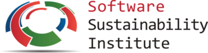
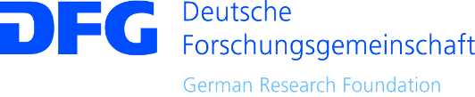

# Surviving the vacuum: A strategy for sustaining software in the absence of RSE teams

Stephan Druskat, Thomas Krause

Third Conference of Research Software Engineers, University of Birmingham, Birmingham, UK, 4 September 2018.

Slides: https://sdruskat.net/rse18-minimal-infrastructure/  

Note:
Naiveté, regression, despair

## Who we are

#### - RSEs in corpus and theoretical linguistics respectively, at the Dept. of German Studies and Linguistics, Humboldt-Universität zu Berlin, Germany

##### Stephan Druskat  
MA in English, Modern German Literature, Linguistics,  
ORCID [0000-0003-4925-7248](https://orcid.org/0000-0003-4925-7248),  
stephan.druskat@hu-berlin.de, <i class="fa fa-twitter"/></i> [@stdruskat](https://twitter.com/stdruskat),
<i class="fa fa-github"/></i> [@sdruskat](https://github.com/sdruskat)

##### Thomas Krause
Computer Science Diploma,  
ORCID [0000-0003-3731-2422](https://orcid.org/0000-0003-3731-2422), krauseto@hu-berlin.de, <i class="fa fa-github"/></i> [@thomaskrause](https://github.com/thomaskrause)

### "Emergency" strategy for research projects that produce software but don't have access to a centralized RSE team, to make their software sustainable/re-usable

# Where we are now

### 1. New project = new person developing software 
<h3 class="fragment">2. ???</h3>

Note:
For every new research project (3 yrs. on average) there's a new person hired to develop software that enables or supports the project's research.

# Where we want to be

### 1. New project = new funding for work hours from a (centralized) RSE team
### 2. Sustainable/re-usable software

Note:
RSE team that will still be around when the project won't be, and takes care of the software

<!-- .slide: data-background="black" -->
<h1 style="color:lightgray;">But we're still here</h1>

<h2 style="color:lightgray;"> (quite literally, in a new project from October 2018)</h2>

# Despair > strategy

#### - Create sustainable research software within project runtime
#### - Determine requirements for sustainable maintenance
#### - ... to be used in researcher training (Software Carpentry?)
#### - ... and practices recommendations for RSEs
#### - Create evidence for making a case for installation of RSE teams

Note:
Because we're still in the old, bad, situation, the only way out of despair is to devise a strategy.
We have funding from DFG for 3 years, classic setup

# Strategy

## More like "strategy": make do
### - Stick to best practices
### - Run project as an open source project
 
## + Two building blocks

# Building blocks

### - Engineer software for re-usability (minimally)
### - Let infrastructure do the rest

# Engineer for re-usability

### 1. Use a generic data model
### 2. Make software extensible by design

# Infrastructure what infrastructure?

### - Use the free stuff that's there
### - Make sure you can exchange tools if necessary
### - Implement an actual maintenance role

# Minimal infrastructure components

# Component functions

Component          | Function
------------- | ------------- | ---------
Source code repo platform        |  Host code, docs, issues, landing page
Release & deposit repo      | Long-term availability of artifacts, Version/citation metadata
Dependencies repo | Reproducible dependency graphs
Maintainer | Integrate, test, release, communicate, manage infrastructure, document/meta-document

## "Maintainers, maintainers, maintainers, ..."

### - Incur cost, so hire (and train!) a student assistant
### - 10 hours / week should be enough in the long run

Note:
- integration, release and testing workflows
- communication with users and contributors
- manages, maintains, substitutes infrastructure components
- documents infrastructural decisions, builds, releases, maintainer changes, ... 

# Our case

### - Deep annotation of linguistic corpora
### - Morph architectural & functional prototype
### - Generic data model (generic graph)
### - Extensible (Eclipse RCP/OSGi)

# Infrastructure

### - GitHub
### - Zenodo
### - Maven Central, eclipse.org P2, P2 via GitHub

# Infrastructure sustainability

### - GitHub > Software Heritage
### - Zenodo (long-term strategy)
### - Dependency repos: system-critical, foundations, Software Heritage
### - (Plan for hot-swapping)

# Maintainers

### - Predetermined breaking point
### - 4 maintainership changes during project

# Document! All! The! Things!

# What have we learned?

### - Minimal requirements for technically sustainable software (?)
### - Minimal infrastructure for sustainable software development (?)

# What will we have learned (ideally)?

### - Sustainable, re-usable software
### - Requirements for sustainable maintenance
### - Evidence for making a case for RSE teams!

Note:
- ... for researcher training
- ... for practices recommendations for RSEs

# Thanks!

**RSE18 Mentoring Programme:** Neil Chue Hong 

**The Software Sustainability Institute** for funding assistance (EPSRC, BBSRC, ESRC Grant EP/N006410/1)

**Project funding:** DFG grant GA 1288/11 ("Research software sustainability")

 

